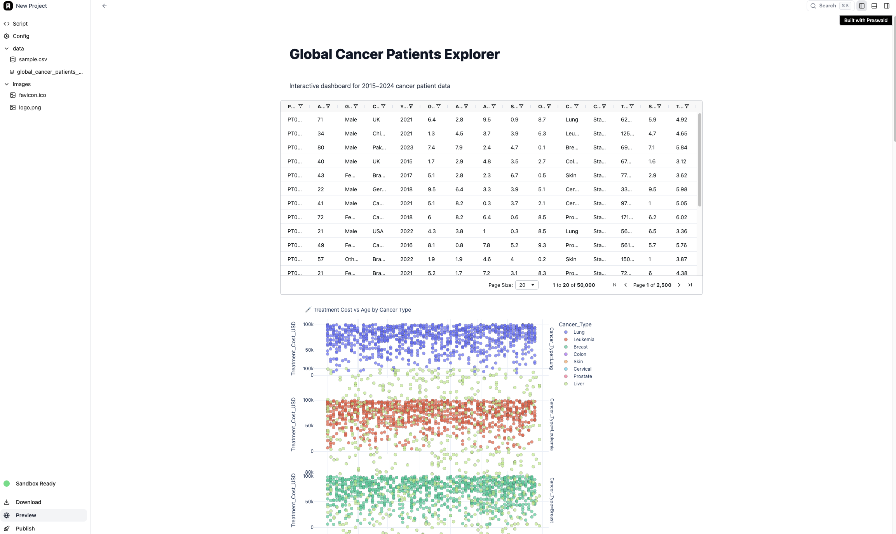
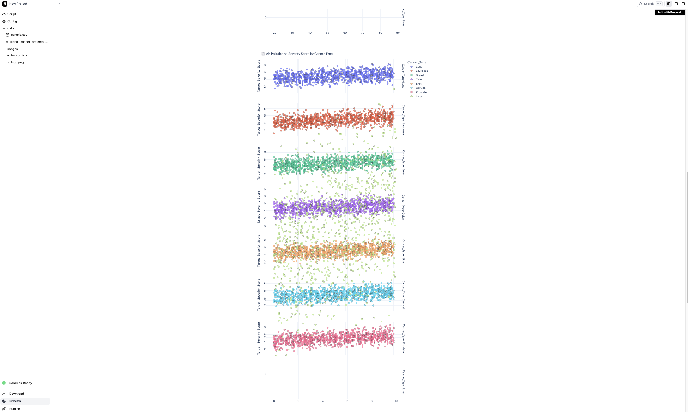
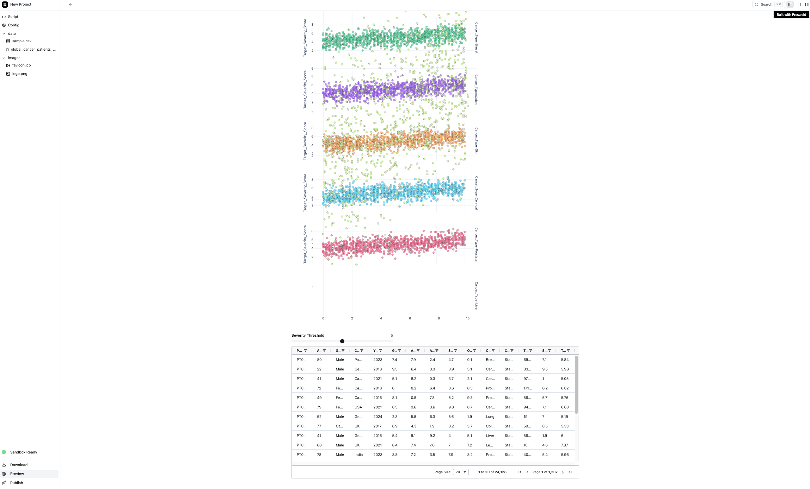

#  Global Cancer Patients Explorer

A Preswald dashboard to explore global cancer patient data (2015–2024).  

Dataset: https://www.kaggle.com/datasets/zahidmughal2343/global-cancer-patients-2015-2024?resource=download

**Features:**  
- Full data table for reference  
- Treatment Cost vs. Age plots by cancer type  
- Air Pollution, Alcohol Use, Smoking, Genetic Risk vs. Severity
- - Slider-driven filtering by Severity Score
 
**Note:**
- I'm unable to deploy it through preswald. and I have some screenshot that I got through preview on Preswald.

